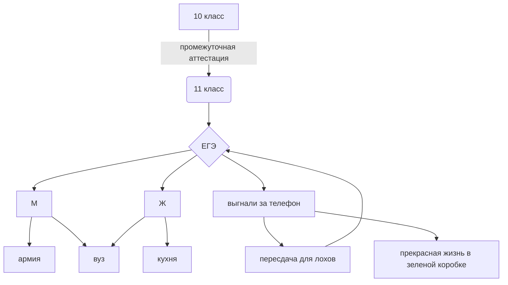

Рейс Ангелина

https://angelina132rais.github.io/ 

 Морзе.ру- программа перевода из английского в морозе (так же таблица море.xlsx)
 

Логика.ру- программа логических уравнений ( так же таблица логика.хlsx)
 

ааааааааааааа.md.html- сайт 
 

Мяу.ру- какая то обязательная программа 
 

Таблица умножения.ру 
 

Хемминг.ру- перевод хеменнга что ли 
 

0.ру - тоже какая то обязательная программа 
 

Помойка.хlsx - там точно таблица умножения и что то ещё обязательное 

Снимок экрана(1).png - это обучение нейросети
 
презентация питон с котятами

Скриншот с яндекса это просмотр видео про мир профессий 
 
решатель зaдач - работает 5 задач

132.ipynb какая то обязательная программа 
 
викторина 

$$ a\lor\left( a\wedge  b \right)=a $$  

 латех формула поглощения (фото есть выше)

$$ \overline{E}^{2}_{1}=\sqrt{\frac{F\times a^{^{x-1}}}{(x-1)\times x}}+ \alpha^{\frac{1}{3}}_{1}+ \beta_{2}^{\frac{2}{3}} $$
 

$$ f(x)=\int\limits_{-\infty}^x e^{-t^2}dt $$

$$ \lim_{x \to \infty} \left(1 + \frac{1}{n} \right)^n = e $$

теория игр
